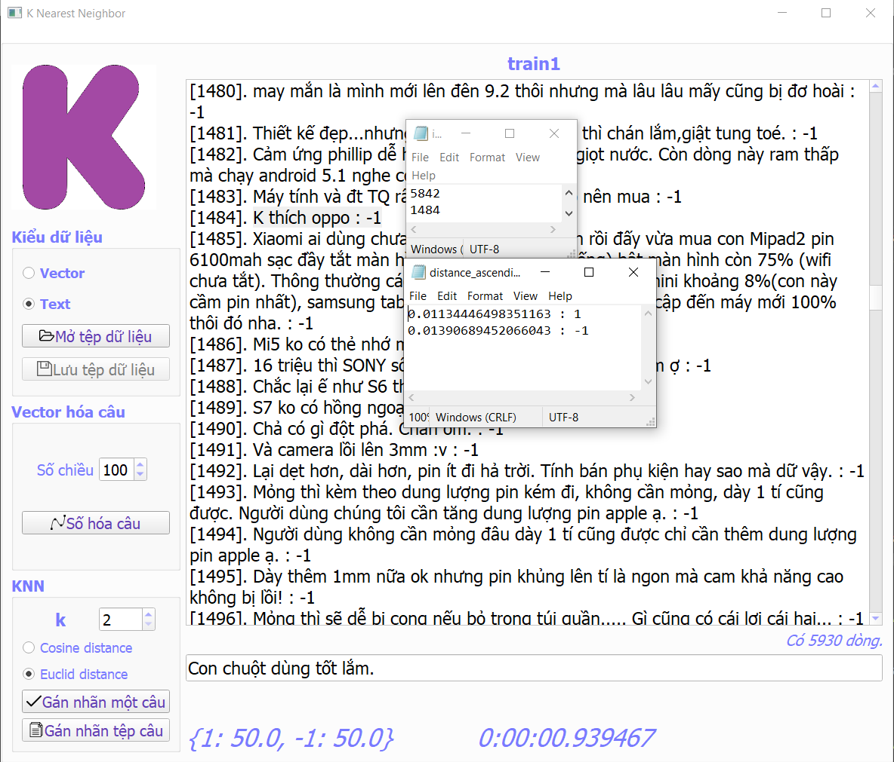

# KNearestNeighbor

Implement Basic K Nearest Neighbor Algorithm.

Calculating Euclidean distance from new Point to datasets point.

Sort ascending distance, get top k to calculate percent to classify.

